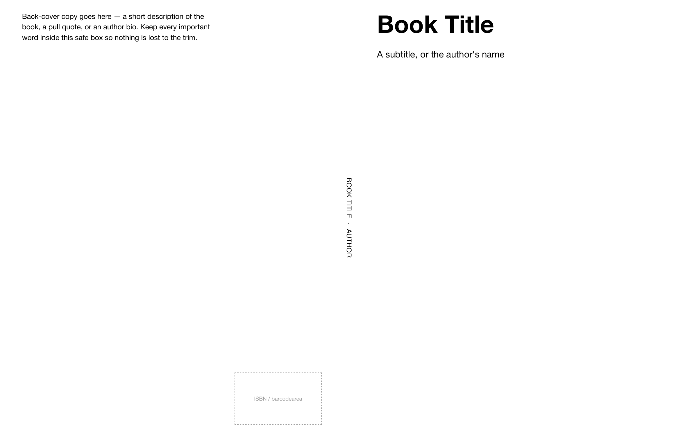
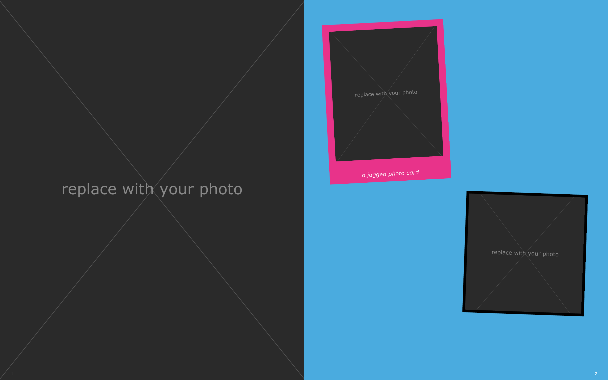
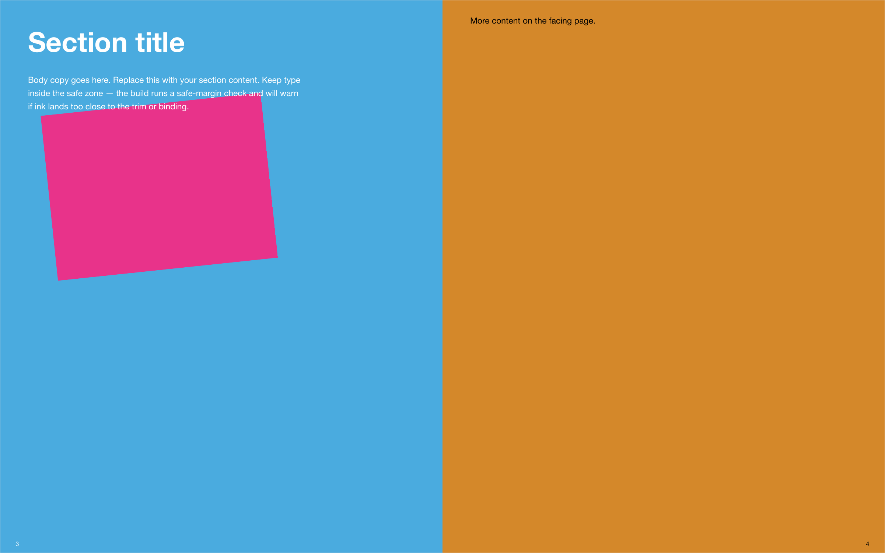
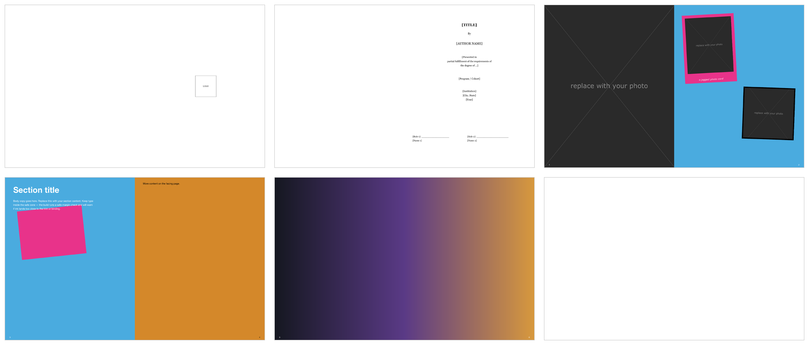

# Showcase

Books made with this template, and how to show off your own.

## Sample book

The stub spreads that ship with the template, rendered by the actual pipeline
(`./book build` → `./book trimmed`, then rasterized from the PDF). Placeholder
art aside, this is exactly what the printer receives — cropped to the 8×10" trim,
with the bleed-parity and safe-margin guards already run by the build.



*`./book cover` — back cover, spine, and front cover as one flat sheet; the
spine width is computed from the page count and paper stock.*



*A full-bleed photo page facing a collage page with rotated, jagged-edge photo
cards (the `02-photo-spread` stub).*



*Display type and color blocks from the `03-color-spread` stub.*


*A cross-gutter spread — one image continues across the gutter
(`04-spread-photo`, prepped with `./book spread-photo`).*



*The whole 10-page sample as facing-page spreads.*

## Make a shareable preview of your book

The full build PDF is print-resolution and large. For sharing a look (email, a
README, social), make a small preview instead:

- **Small PDF draft** — `./book trimmed` produces a trim-cropped preview and a
  rasterized `*-trimmed-draft.pdf` you can email. (Needs `mutool`; see the README.)
- **Browser view** — `./book preview-web <section>` to screenshot a page from the
  browser. Quick, but a browser is not WeasyPrint — for a true-to-print image,
  screenshot the PDF instead.
- **Page images from the PDF** — with poppler installed:
  ```
  pdftoppm -png -r 150 builds/<slug>/master-<slug>-trimmed.pdf preview
  ```
  gives one PNG per page at 150 DPI. (The images above were made exactly this
  way, with facing pages stitched side-by-side via ImageMagick `+append`.)

Keep marketing images to the **trimmed** (no-bleed) preview so what people see is
what gets bound.

## Made with this template

Have you published something with it? Open a PR adding a row — title, a one-line
description, page size/binding, and a link (to the book, a shop page, or a photo).

| Book | By | Format | Link |
|---|---|---|---|
| _Your book here_ | you | e.g. trade-6x9 perfect-bound | link |

<!--
Add your book above. Keep the images light (link out to full-res); this table is
just a directory, not an asset dump. See CONTRIBUTING.md.
-->
